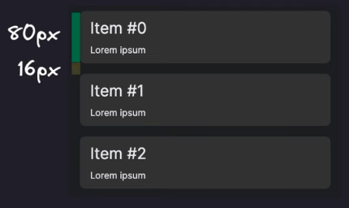

# Tweaks útiles en VueJS

## Network Status Based UI / UX, Image Optimization, Rendering Performance y ZZZ

---

<!-- _class: lead -->

# Introducción

---

<!-- _class: lead -->

-   Vue destaca por: Simplicidad y pocas restricciones + Buena comunidad.
-   Buena base con todo lo necesario y muy ampliable con libertad.
-   Cantidad de tweaks tanto de performance cómo visuales o de ahorro de recursos.

---

<!-- _class: lead -->

# Algunos tweaks útiles (hay muchos más)

-   Network Status Based UI
-   Image Optimization with Nuxt Image
-   Rendering Performance with Virtual Lists
-   Rendering Performance with directives (avoid unnecessary re-render)

---

<!-- _class: lead -->

# Network Status Based UI / UX

---

**Network Status Based UI / UX**

-   Ideales en situaciones en las que tenemos una conexión a internet lenta / inestable.
-   Útil para informar a los usuarios del estado de la conexión
-   Muy utilizado en sitios de streaming (regulación del bitrate), o de edición de documentos onLine.
-   Nota: Las funciones (useNetwork, useOnline) de VueUse ya implementan esto.
-   Veremos cómo hacerlo "a mano"

---


---


---

**Ejemplo: Mostrar info conexión**

-   Nos apoyamos en window.navigator:

```javascript
const navigator = window.navigator; // Info ab. user-agent

const isOnline = ref(navigator.onLine);

// Listen for events of the navigator interface to detect NW changes
window.addEventListener("online", () => {
    isOnline.value = true;
});
window.addEventListener("offline", () => {
    isOnline.value = false;
});
```

-   Utilizamos isOnline en nuestra UI para adaptarla

---

**Ejemplo: Enviar versión lightweight de nuestra app**

-   Nos apoyaremos en "Network Information API" (experimental), aporta información adicional sobre la red del usuario.

-   Ejemplos:

    -   NetworkInformation.downlink
    -   NetworkInformation.rtt
    -   NetworkInformation.saveData
    -   NetworkInformation.effectiveType
    -   etc

-   Referencia: [MDN: NetworkInformation](https://developer.mozilla.org/en-US/docs/Web/API/NetworkInformation)

---

-   NetworkInformation.downlink -> Estimación del ancho de banda en mbps


---

-   NetworkInformation.rtt -> Round Trip Time (tiempo en ms que un paquete de datos tarda en volver a su emisor habiendo pasado por su destino)


---

-   NetworkInformation.saveData -> Si el cliente tiene activada esta opción


---

-   NetworkInformation.effectiveType -> Tipo de red del cliente (estimado según otros valores)


---

-   Basándose en estos datos, se lleva a cabo el "Adaptive Loading", en el que no sólo se tiene en cuenta el tamaño de pantalla para decidir qué servir, sino que también se tiene en cuenta la red y Hardware del dispositivo del usuario.

-   Se tienen en cuenta también preferencias del usuario, cómo por ejemplo el modo ahorro de datos, para servir assets más o menos grandes.

---


---

-   Accediendo a esta información:

```javascript
const navigator = window.navigator; // Info ab. user-agent
const connection = (navigator as any). connection

// Set default to 4g
const effectiveType = ref('4g')

updateNetworkInfo() {
    effectiveType.value = connection.effectiveType ?? 'unknown'
}

if (connection) { //the API is not available on every browser
    // Add eventListener for when connection changes
    connection.addEventListener('change', updateNetworkInfo)
    updateNetworkInfo() //Make a call to update the netw. info on the
}
```

---

-   Utilizando la información para mostrar una imagen a completa resolución o una versión blurry de un thumbnail.

```html

```

-   Tener en cuenta que Safari o FFox aún no lo soportan

---

<!-- _class: lead -->

# Image Optimization with [Nuxt Image](https://v1.image.nuxtjs.org/)

---

**Image Optimization with Nuxt Image**

-   El performance de nuestra web impacta todo (ux, ratios conversión, usabilidad, etc).

-   Lo que más impacta al performance es la candidad de datos que el usuario ha de descargar.

-   Hay varias maneras de reducir esta cantidad de datos, una de las más comunes siendo la optimización de imágenes.

-   Ejemplo: Twitter tiene acceso a la versión HD de nuestra imagen de perfil, pero en la card del tweet, no tiene sentido. Trae una versión reducida.

---


---

-   El componente de Nuxt Image, nos permite interactuar con distintos servicios de compresión de imagen, especificando desde el tag en el template <nuxt-img>, el tamaño y formato que consideremos ideal para la imagen.

```html
<template>
    <nuxt-img src="/image.png" width="48" height="48" format="webp" />
</template>
```

-   La documentación es muy completa y destaca del componente, la cantidad de proveedores de compresión de imagen disponibles

---


---

-   La configuración del proveedor es muy sencilla.


---

-   Nuxt Image nos expone dos componentes

| Nuxt Image       |   Nativo    |
| ---------------- | :---------: |
| <nuxt-img />     |      |
| <nuxt-picture /> | <picture /> |

-   Podemos además, especificar para algunos proveedores distintos tamaños para adoptar carácter responsive mediante "sizes"

```html
<template>
    <nuxt-img
        src="/image.png"
        sizes="sm:100px md:300px lg:900px"
        format="webp"
    />
</template>
```

---

-   Algunas otras acciones que se pueden tomar sobre las imágenes (depende del soporte del proveedor) son:
    -   Grayscale
    -   Blur
    -   Smart cropping
    -   Focal points
    -   Image Rounding
    -   Rotation
    -   etc

---

-   Estas opciones se pasan mediante la prop :modifiers

```html
<template>
    <nuxt-img
        src="/image.png"
        sizes="sm:100px md:300px lg:900px"
        format="webp"
        :modifiers="{
        filters: {
            blur: 10,
            rotate: 90
        }
    }"
    />
</template>
```

---

<!-- _class: lead -->

# Rendering Performance

---

**Rendering Performance**

-   El performance de renderizado es una métrica muy importante para las aplicaciones web

-   Por cada segundo que nuestra app tarda en renderizar, más probable es que el usuario salga de la misma

-   La aplicación ha de sentirse responsive ante el input de los usuarios

-   Vue tiene por defecto un performance bastante bueno

-   Aún así, hay maneras en las que podemos mejorar este performance

---

1. Virtual Lists
2. Eliminación de re-renderizaciónes innecesarias
    - v-once
    - v-memo

---

**Rendering Performance with Virtual Lists**

-   Si intentamos recorrer una lista enorme con v-for, tendremos un impacto en el performance de nuestra app. Tendremos tanto una primera carga lenta, cómo un scroll muy laggy.

-   La solución a esta situación pasa por el **_virtual scrolling_**, en concreto para listas, por el **_list virtualization_**

-   Renderizaremos divs que estén cerca del viewport actual

-   Lo más común es combinar el virtual scrolling con el infinite scrolling (paginación a la llegada al final de la lista actual)

-   Visualización scroll v-for vs. virtual scroll

---


---

-   Hay varias maneras de lograr el efecto deseado, pero en este caso vamos a ver la opción con el composable **_useVirtualList_** de VueUse

-   Lo combinaríamos con **_useInfiniteScroll_** para lograr un efecto similar al que hacer twitter.

-   El uso del composable **_useVirtualList_** nos ahorra realizar muchos cálculos y tiempo a la hora de pensar cómo hacer para que la zona a renderizar se corresponda correctamente con el scrollbar (vs el total de elementos de nuestra lista)

-   Afortunadamente, este tipo de soluciones tan testadas y recomendadas nos permiten obtener ganancias de rendimiento de manera sencilla. Tendremos que instalar [VueUse](https://vueuse.org/)

---

```javascript
<script setup>
import { ref } from 'vue'
import { useVirtualList } from '@vueuse/core'

// Data -> [50] of loreipsum
// We can use it as a ref or not. It's the same
const data = ref(Array.from(Array(50).keys(), () => 'Lorem Ipsum'))

// Properties returned by useVirtualList
// list -> items that should actually be shown
// containerProps -> ref for container element, inline styles, onScroll event
// wrapperProps -> styles for our wrapper (like height + margin)

const {list, containerProps, wrapperProps} = useVirtualList(data, {
    itemHeight: 96 // Used for calculations
    overscan: 5 // Numb of items to be rendered outside the viewport (up n down). Smoother scroll.
})
</script>
```

---

```javascript
<template>
    <div v-bind="containerProps">
        <div v-bind="wrapperProps">
            <div
                v-for="{index, data} in list"
                :key="index"
                class="item-card-class" // Height adds up to itemHeight!
            >
                <h2 class="h2-class">Item #{{index}}</h2>
                <p class="p-class">{{data}}</p>
            </div>
        </div>
    </div>
</template>
```

---



---

-   Default overscan is 5


---


---

**Rendering Performance with v-once**

-   Renderiza el elemento o componente una sola vez. Después de ese render inicial, ese elemento/componente y todos sus hijos, serán tratados cómo estáticos


---

-   Para lograrlo, simplemente:

```html
<!-- v-once in a single html element -->
<p v-once>{{myStaticMessage}}</p>

<!-- v-once in an element with children -->
<div v-once>
    <p>{{message}}</p>
</div>

<!-- v-once in a component -->
<my-component v-once />

<!-- v-once in a v-for directive -->
<ul>
    <li v-for="item in list" :key="item" v-once>{{item}}</li>
</ul>
```

---

-   Consideraciones de v-once

    -   Tratar con cuidado esta directiva. Aunque cambien los datos reactivos, el componente no se re-renderizará
    -   La combinación de v-once con otras directivas puede tener efectos no-deseados, por la prioridad de este.

    ```html
    <!-- v-once with conditional components -->
    <p v-if="show" v-once>{{myStaticMessage}}</p>
    ```

    -   En el ejemplo, aunque cambie el show, el componente no reaccionará

-   Utilizaremos v-once sólo cuándo sepamos que un componente no se ha de re-renderizar aunque los datos se actualizen.

---

**Rendering Performance with v-memo**

-   Si queremos limitar cuándo un elemento se ha de re-renderizar, pero sin limitarlo sólo a la primera vez, utilizaremos v-memo

-   v-memo memoriza un sub-arbol de hijos de un componente y almacena renderizaciones previas para mejorar el performance

-   Lo podemos utilizar en cualquier elemento y acepta un array de dependencias. Limitará la re-renderización a cuándo alguna de esas dependencias cambien.

-   Importante: v-memo no funciona dentro de v-for, pero si al mismo nivel (en el mismo elemento que v-for si, pero no dentro)

---

-   El <p> se re-renderizará reactivamente ante el cambio de msg o de count

```html
<!-- v-memo and some dependencies -->
<p v-memo="[msg, count]">{{msg}}, {{count}}</p>
```

-   Si utilizamos v-memo pero pasándole un array de dependencias vacío, obtenemos el mismo resultado que utilizando v-once, ya que no hay nada que haga trigger del re-render. Si no pasamos array, lo hace de manera inteligente


---

-   La documentación oficial considera que v-memo debería de ser utilizado sólo en micro-optimizaciones en escenarios de performance crítico (no utilizarlo by-default)

-   El uso más popular es a la hora de renderizar listas con muchos registros (length > 1000)

---

<!-- _class: lead -->

# Conclusión

---

**Conclusión**

-   Vue rocks

---

<!-- _class: lead -->

# Fin.
