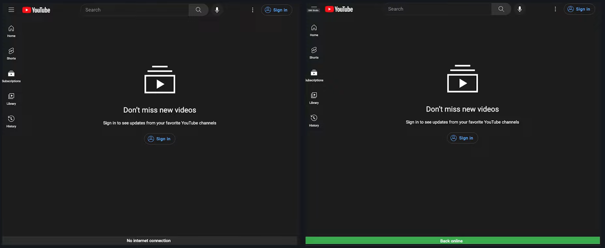
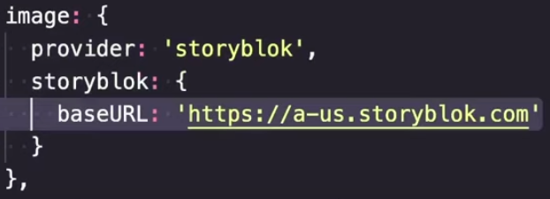

# Tweaks útiles en VueJS

## Network Status Based UI / UX, Image Optimization, Rendering Performance y ZZZ

---

<!-- _class: lead -->

# Introducción

---

<!-- _class: lead -->

-   Vue destaca por: Simplicidad y pocas restricciones + Buena comunidad.
-   Buena base con todo lo necesario y muy ampliable con libertad.
-   Cantidad de tweaks tanto de performance cómo visuales o de ahorro de recursos.

---

<!-- _class: lead -->

# Algunos tweaks útiles (hay muchos más)

-   Network Status Based UI
-   Image Optimization with Nuxt Image
-   Rendering Performance with Virtual Lists
-   ZZZ

---

<!-- _class: lead -->

# Network Status Based UI / UX

---

**Network Status Based UI / UX**

-   Ideales en situaciones en las que tenemos una conexión a internet lenta / inestable.
-   Útil para informar a los usuarios del estado de la conexión
-   Muy utilizado en sitios de streaming (regulación del bitrate), o de edición de documentos onLine.
-   Nota: Las funciones (useNetwork, useOnline) de VueUse ya implementan esto.
-   Veremos cómo hacerlo "a mano"

---



---


---

**Ejemplo: Mostrar info conexión**

-   Nos apoyamos en window.navigator:

```javascript
const navigator = window.navigator; // Info ab. user-agent

const isOnline = ref(navigator.onLine);

// Listen for events of the navigator interface to detect NW changes
window.addEventListener("online", () => {
    isOnline.value = true;
});
window.addEventListener("offline", () => {
    isOnline.value = false;
});
```

-   Utilizamos isOnline en nuestra UI para adaptarla

---

**Ejemplo: Enviar versión lightweight de nuestra app**

-   Nos apoyaremos en "Network Information API" (experimental), aporta información adicional sobre la red del usuario.

-   Ejemplos:

    -   NetworkInformation.downlink
    -   NetworkInformation.rtt
    -   NetworkInformation.saveData
    -   NetworkInformation.effectiveType
    -   etc

-   Referencia: [MDN: NetworkInformation](https://developer.mozilla.org/en-US/docs/Web/API/NetworkInformation)

---

-   NetworkInformation.downlink -> Estimación del ancho de banda en mbps


---

-   NetworkInformation.rtt -> Round Trip Time (tiempo en ms que un paquete de datos tarda en volver a su emisor habiendo pasado por su destino)


---

-   NetworkInformation.saveData -> Si el cliente tiene activada esta opción


---

-   NetworkInformation.effectiveType -> Tipo de red del cliente (estimado según otros valores)


---

-   Basándose en estos datos, se lleva a cabo el "Adaptive Loading", en el que no sólo se tiene en cuenta el tamaño de pantalla para decidir qué servir, sino que también se tiene en cuenta la red y Hardware del dispositivo del usuario.

-   Se tienen en cuenta también preferencias del usuario, cómo por ejemplo el modo ahorro de datos, para servir assets más o menos grandes.

---


---

-   Accediendo a esta información:

```javascript
const navigator = window.navigator; // Info ab. user-agent
const connection = (navigator as any). connection

// Set default to 4g
const effectiveType = ref('4g')

updateNetworkInfo() {
    effectiveType.value = connection.effectiveType ?? 'unknown'
}

if (connection) { //the API is not available on every browser
    // Add eventListener for when connection changes
    connection.addEventListener('change', updateNetworkInfo)
    updateNetworkInfo() //Make a call to update the netw. info on the
}
```

---

-   Utilizando la información para mostrar una imagen a completa resolución o una versión blurry de un thumbnail.

```html

```

-   Tener en cuenta que Safari o FFox aún no lo soportan

---

<!-- _class: lead -->

# Image Optimization with [Nuxt Image](https://v1.image.nuxtjs.org/)

---

**Image Optimization with Nuxt Image**

-   El performance de nuestra web impacta todo (ux, ratios conversión, usabilidad, etc).

-   Lo que más impacta al performance es la candidad de datos que el usuario ha de descargar.

-   Hay varias maneras de reducir esta cantidad de datos, una de las más comunes siendo la optimización de imágenes.

-   Ejemplo: Twitter tiene acceso a la versión HD de nuestra imagen de perfil, pero en la card del tweet, no tiene sentido. Trae una versión reducida.

---


---

-   El componente de Nuxt Image, nos permite interactuar con distintos servicios de compresión de imagen, especificando desde el tag en el template <nuxt-img>, el tamaño y formato que consideremos ideal para la imagen.

```html
<template>
    <nuxt-img src="/image.png" width="48" height="48" format="webp" />
</template>
```

-   La documentación es muy completa y destaca del componente, la cantidad de proveedores de compresión de imagen disponibles

---


---

-   La configuración del proveedor es muy sencilla.



---

-   Nuxt Image nos expone dos componentes

| Nuxt Image       |   Nativo    |
| ---------------- | :---------: |
| <nuxt-img />     |      |
| <nuxt-picture /> | <picture /> |

-   Podemos además, especificar para algunos proveedores distintos tamaños para adoptar carácter responsive mediante "sizes"

```html
<template>
    <nuxt-img
        src="/image.png"
        sizes="sm:100px md:300px lg:900px"
        format="webp"
    />
</template>
```

---

-   Algunas otras acciones que se pueden tomar sobre las imágenes (depende del soporte del proveedor) son:
    -   Grayscale
    -   Blur
    -   Smart cropping
    -   Focal points
    -   Image Rounding
    -   Rotation
    -   etc

---

-   Estas opciones se pasan mediante la prop :modifiers

```html
<template>
    <nuxt-img
        src="/image.png"
        sizes="sm:100px md:300px lg:900px"
        format="webp"
        :modifiers="{
        filters: {
            blur: 10,
            rotate: 90
        }
    }"
    />
</template>
```

---

<!-- _class: lead -->

# Conclusión

---

**Conclusión**

-   Vue rocks

---

<!-- _class: lead -->

# Fin.
