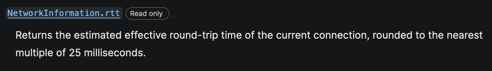

# Tweaks en VueJS

## Network Status Based UI / UX, XXX, YYY y ZZZ

---

<!-- _class: lead -->

# Introducción

---

<!-- _class: lead -->

-   Vue destaca por: Simplicidad y pocas restricciones + Buena comunidad
-   Buena base con todo lo necesario y muy ampliable con libertad
-   Cantidad de tweaks tanto de performance cómo visuales o de ahorro de recursos

---

<!-- _class: lead -->

# Algunos tweaks (hay muchos más)

-   Network Status Based UI
-   XXX
-   YYY
-   ZZZ

---

<!-- _class: lead -->

# Network Status Based UI / UX

---

**Network Status Based UI / UX**

-   Ideales en situaciones en las que tenemos una conexión a internet lenta / inestable.
-   Útil para informar a los usuarios del estado de la conexión
-   Muy utilizado en sitios de streaming (regulación del bitrate), o de edición de documentos onLine.
-   Nota: Las funciones (useNetwork, useOnline) de VueUse ya implementan esto.
-   Veremos cómo hacerlo "a mano"

---


---


---

**Ejemplo: Mostrar info conexión**

-   Nos apoyamos en window.navigator:

```javascript
const navigator = window.navigator; // Info ab. user-agent

const isOnline = ref(navigator.onLine);

// Listen for events of the navigator interface to detect NW changes
window.addEventListener("online", () => {
    isOnline.value = true;
});
window.addEventListener("offline", () => {
    isOnline.value = false;
});
```

-   Utilizamos isOnline en nuestra UI para adaptarla

---

**Ejemplo: Enviar versión lightweight de nuestra app**

-   Nos apoyaremos en "Network Information API" (experimental), aporta información adicional sobre la red del usuario

-   Ejemplos:

    -   NetworkInformation.downlink
    -   NetworkInformation.rtt
    -   NetworkInformation.saveData
    -   NetworkInformation.effectiveType
    -   etc

-   Referencia: [MDN: NetworkInformation](https://developer.mozilla.org/en-US/docs/Web/API/NetworkInformation)

---

-   NetworkInformation.downlink -> Estimación del ancho de banda en mbps


---

-   NetworkInformation.rtt -> Round Trip Time (tiempo en ms que un paquete de datos tarda en volver a su emisor habiendo pasado por su destino)



---

-   NetworkInformation.saveData -> Si el cliente tiene activada esta opción


---

-   NetworkInformation.effectiveType -> Tipo de red del cliente (estimado según otros valores)


---

-   Basándose en estos datos, se lleva a cabo el "Adaptive Loading", en el que no sólo se tiene en cuenta el tamaño de pantalla para decidir el front-end a servir, sino que también se tiene en cuenta el Hardware del dispositivo.

---

<!-- _class: lead -->

# Conclusión

---

**Conclusión**

-   Vue rocks

---

<!-- _class: lead -->

# Fin.
